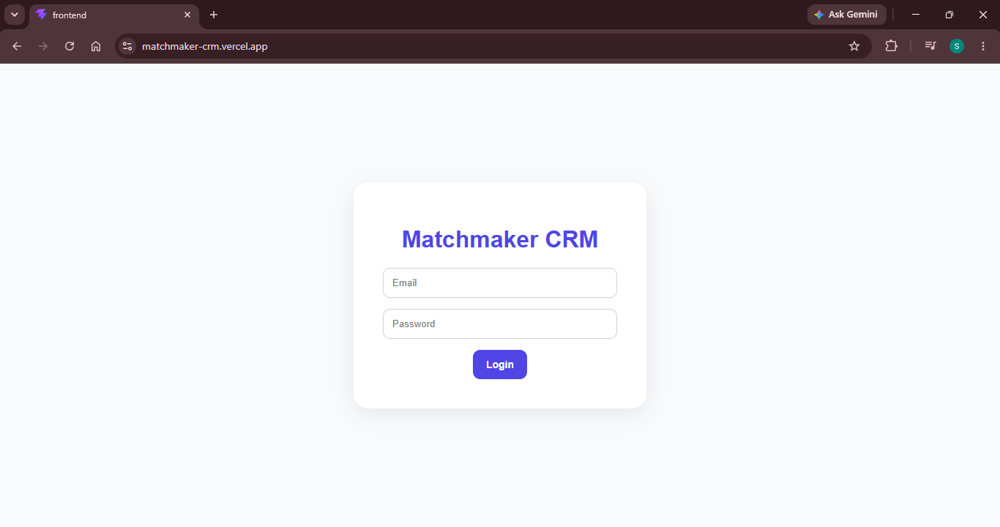
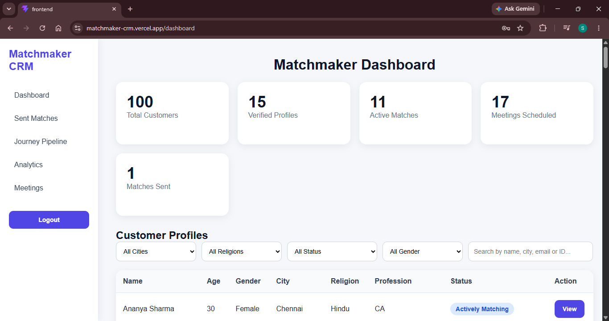
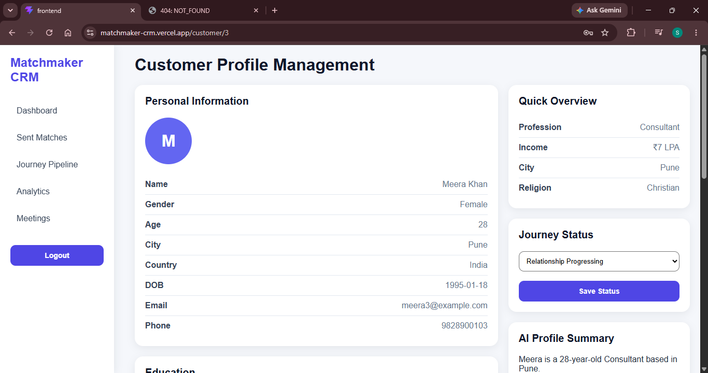
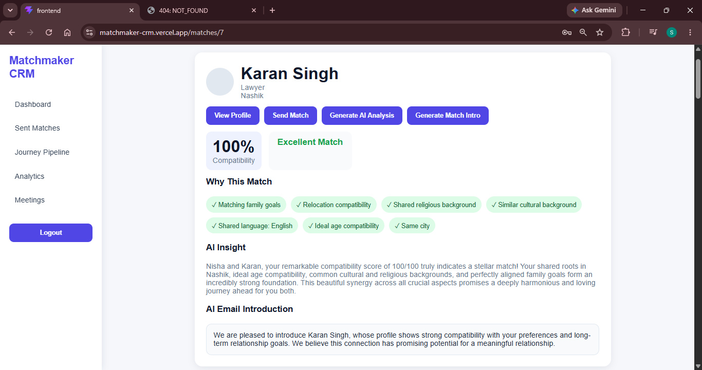
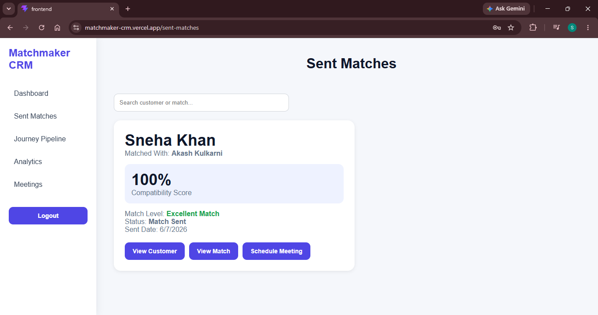
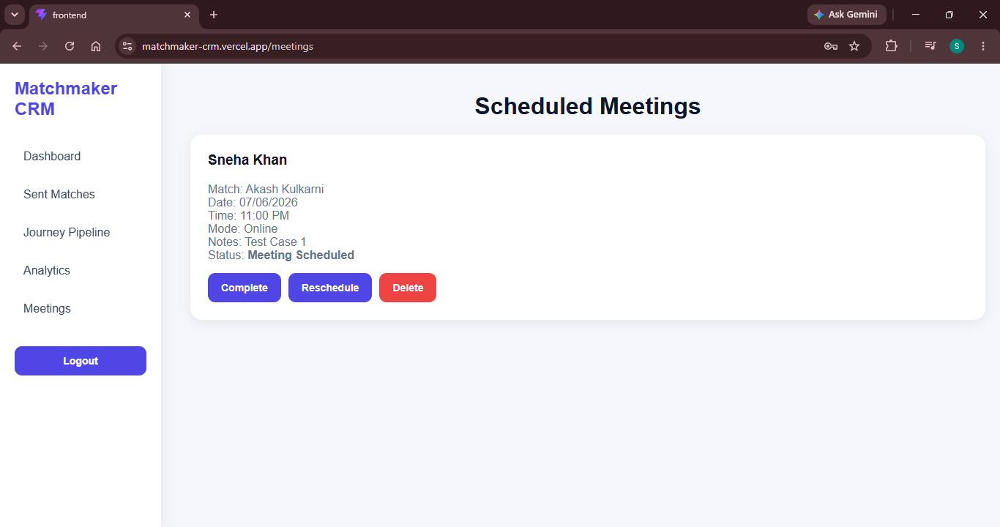
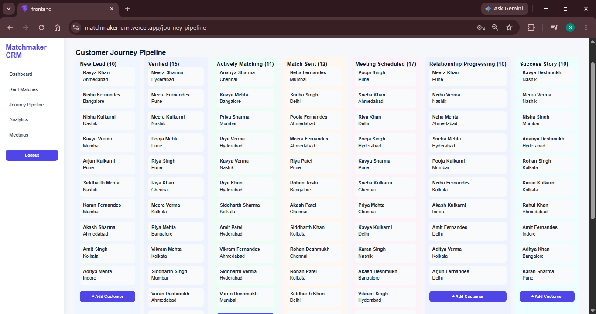
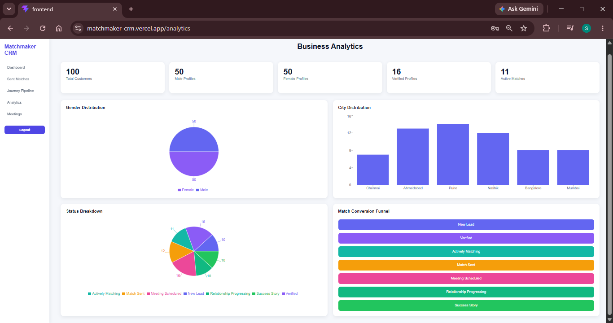
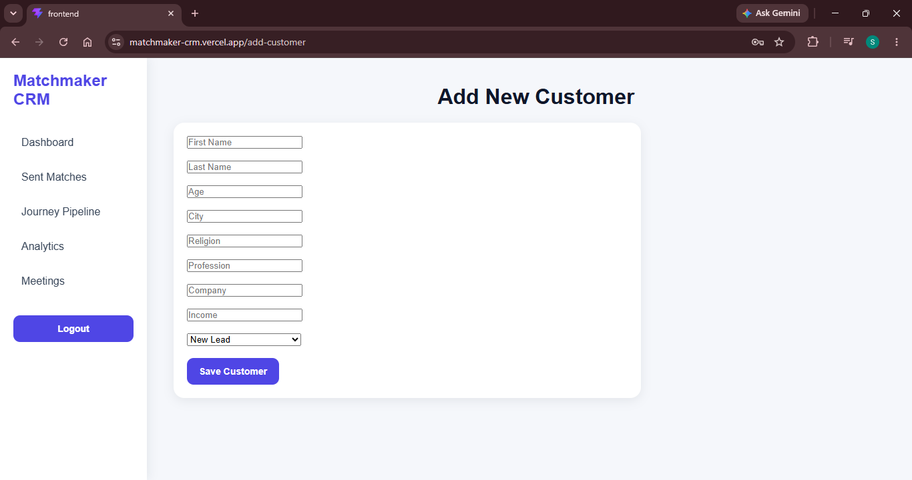

# Matchmaker CRM

An AI-powered Customer Relationship Management (CRM) system designed for matchmaking and matrimonial agencies.

The application helps relationship managers manage customer profiles, track customer journeys, generate AI-powered compatibility analysis, recommend suitable matches, schedule meetings, and monitor business analytics.

---

## Live Demo

Frontend:
https://matchmaker-crm.vercel.app

Backend:
https://matchmaker-crm.onrender.com

---

# Features

## Customer Management

- View customer profiles
- Add new customers
- Search customers
- Filter by city, religion, gender, and status
- Manage customer journey stages

## AI Match Recommendation

- Compatibility score calculation
- Match ranking
- Religious compatibility
- Language compatibility
- Relocation compatibility
- Family goal compatibility
- Lifestyle compatibility
- Profession compatibility

## AI Compatibility Analysis

Uses Google Gemini AI to generate:

- Compatibility explanations
- Match insights
- Relationship recommendations

## AI Match Introduction

Automatically generates personalized match introduction messages.

## Journey Pipeline

Track customer progress through:

- New Lead
- Verified
- Actively Matching
- Match Sent
- Meeting Scheduled
- Relationship Progressing
- Success Story

## Sent Matches

- Track sent recommendations
- View compatibility scores
- Schedule meetings

## Meeting Management

- Schedule meetings
- Reschedule meetings
- Complete meetings
- Delete meetings

## Business Analytics

- Gender distribution
- Customer city distribution
- Status breakdown
- Match conversion funnel
- KPI cards

---

# Technology Stack

## Frontend

- React
- Vite
- React Router DOM
- Axios
- Framer Motion
- Recharts

## Backend

- Node.js
- Express.js

## AI

- Google Gemini API

## Deployment

- Vercel
- Render

---

# Screenshots

## Login Page



---

## Dashboard



---

## Customer Profile



---

## Match Recommendations



---

## Sent Matches



---

## Meetings



---

## Journey Pipeline



---

## Analytics Dashboard



---

## Add Customer



---

# Installation Guide

## Clone Repository

```bash
git clone https://github.com/Samuruddhi09/matchmaker-crm.git
```

```bash
cd matchmaker-crm
```

---

# Backend Setup

```bash
cd backend
npm install
```

Create a `.env` file inside backend folder.

```env
GEMINI_API_KEY=your_gemini_api_key
```

Run Backend:

```bash
npm start
```

Server runs on:

```text
http://localhost:5000
```

---

# Frontend Setup

Open a second terminal:

```bash
cd frontend
npm install
```

Create `.env` file:

```env
VITE_API_URL=http://localhost:5000/api
```

Run frontend:

```bash
npm run dev
```

Frontend runs on:

```text
http://localhost:5173
```

---

# API Endpoints

## Customers

GET /api/customers

GET /api/customers/:id

POST /api/customers

---

## Matches

GET /api/matches/:id

POST /api/matches/ai-analysis

POST /api/matches/generate-intro

---

# Project Structure

matchmaker-crm/

├── backend/

│ ├── routes/

│ ├── data/

│ ├── utils/

│ └── server.js

│

├── frontend/

│ ├── src/

│ │ ├── pages/

│ │ ├── components/

│ │ ├── services/

│ │ └── styles/

│ │

│ └── public/

│ └── screenshots/

│

└── README.md

---

# Future Improvements

- Integration of a Machine Learning recommendation model for more accurate compatibility prediction.
- Use of real-world matrimonial datasets to improve match quality and recommendation accuracy.
- Advanced LLM-powered compatibility analysis with deeper relationship insights.
- AI-generated personalized relationship advice and match explanations.
- Automated email notifications for match recommendations and meeting updates.
- SMS/WhatsApp notifications for meeting reminders and customer engagement.
- Online video meeting integration for virtual matchmaking sessions.
- Success Story management module with relationship tracking and testimonials.
- Drag-and-drop customer movement within the Journey Pipeline.
- Advanced customer compatibility card with detailed personality and preference analysis.
- Meeting calendar integration with Google Calendar and Outlook.
- Real-time notifications and activity tracking.
- Secure authentication and role-based access control using JWT.
- MongoDB database integration for persistent data storage.
- Admin and Relationship Manager role management.

---

# Author

Samruddhi Vispute

Final Year Engineering Student

Data Science & Machine Learning Enthusiast

GitHub:
https://github.com/Samuruddhi09
